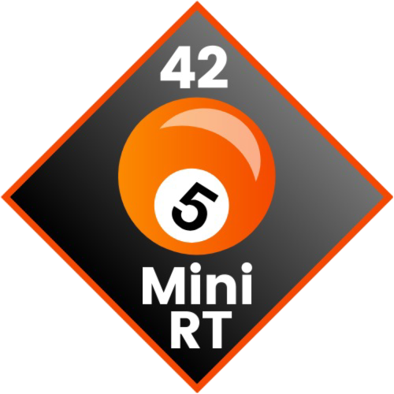
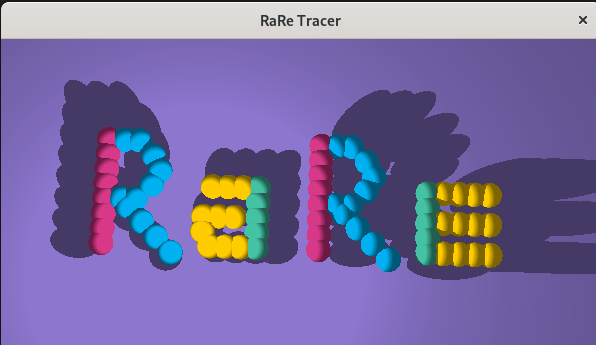

  
  <h2>42 MİNİRT PROJECT</h2>
    
    
    
    
    
   
<h4>
    <a href="https://github.com/emre-mr246/42_ring4_minirt/issues">❔ Ask a Question</a>
   · 
    <a href="https://github.com/emre-mr246/42_ring4_minirt/issues">🪲 Report Bug</a>
   · 
    <a href="https://github.com/emre-mr246/42_ring4_minirt/issues">💬 Request Feature</a>
</h4>

## Introduction 🚀

This project is a simple 3D ray tracing renderer that creates photorealistic images by simulating light interactions with objects in a scene. Built using C, it explores the fundamentals of computer graphics and mathematical algorithms.

## Image 📸

## Usage 🔍

1. In the project's main directory, compile the library using the `make` command.
   `$ make` 

2. You can run the program with the following command:
   `$ ./minirt map.rt` 
    
